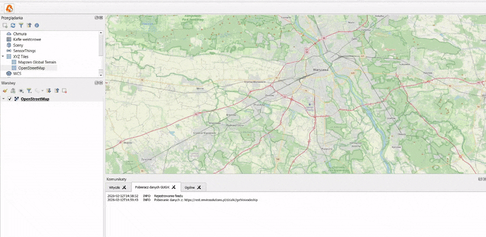

# Pobieracz danych GUGiK

## PL
Wtyczka QGIS do pobierania danych przestrzennych z zasobów GUGiK. Od wersji 0.2 wtyczka generuje dodatkowo raport TXT z informacjami dodatkowymi na temat pobranych plików.

## Instrukcja pobrania:
1. Wtyczkę należy zainstalować w QGIS jako ZIP lub wgrać pliki wtyczki do lokalizacji `C:\Users\User\AppData\Roaming\QGIS\QGIS3\profiles\default\python\plugins`.
2. Aby uruchomić wtyczkę, należy kliknąć na ikonę pomarańczowego drzewa.
3. Jeżeli ikona wtyczki nie jest widoczna w panelu warstw, spróbuj zrestartować QGIS.
4. Jeżeli wtyczka nadal nie jest widoczna, należy przejść w QGIS Desktop do Wtyczki -> Zarządzanie wtyczkami -> Zainstalowane -> Pobieracz danych GUGiK -> Odinstalować wtyczkę i zainstalować ponownie.

## Instrukcja użytkowania:
1. Po uruchomieniu wtyczki w prawym dolnym rogu pojawi się jej widżet. Należy wybrać jeden ze sposobów wyszukiwania danych oraz określić ścieżkę zapisu plików. 
2. Następnie należy rozwinąć potrzebną kategorię danych, zaznaczyć wszystkie wymagane parametry i kliknąć "Pobierz". 
3. Proces pobierania można zatrzymać. W tym celu należy kliknąć na niebieski pasek na dole z prawej strony, wybrać proces odpowiedni i nacisnąć na pojawiający się krzyżyk.

### Wtyczka pozwala na pobieranie następujących warstw dla obszaru Polski:

#### Usługa WMS/Geoportal:
- Ortofotomapy RGB/CIR - ortofotomapa cyfrowa i zobrazowanie w bliskiej podczerwieni
- Numeryczny model terenu (NMT)/Numeryczny model pokrycia terenu (NMPT) - Układy wysokościowe PL-EVRF2007-NH, PL-KRON86-NH (ASC)
- Dane pomiarowe LIDAR w postaci plików LAS - Układy wysokościowe PL-EVRF2007-NH, PL-KRON86-NH (LAZ)
- Obrazy intensywności - opracowane na podstawie skanowania laserowego (LIDAR)

#### Usługa WFS:
- Ortofotomapa wraz ze skorowidzem
- Prawdziwa ortofotomapa wraz ze skorowidzem
- Dane pomiarowe LIDAR wraz ze skorowidzem
- Numeryczny model terenu (NMT) wraz ze skorowidzem
- Numeryczny model pokrycia terenu (NMPT) wraz ze skorowidzem

#### Paczka danych:
- Paczki danych Bazy Danych Obiektów Topograficznych 1:10000 (BDOT10K) - powiatowe, wojewódzkie lub krajowe (SHP, GML, GPKG)
- Paczki danych Ewidencji Gruntów i Budynków (EGiB) - powiatowe (GML)
- Paczki danych Bazy Danych Obiektów Ogólnogeograficznych (BDOO) - wojewódzkie lub krajowe (XML)
- Paczki danych Państwowego Rejestru Nazw Geograficznych (PRNG) - miejscowości RP, obiekty fizjograficzne RP, nazwy geograficzne świata (GML, SHP, XLSX)
- Paczki danych Państwowego Rejestru Granic (PRG) - gminne, powiatowe, wojewódzkie, krajowe (GML, SHP)
- Paczki danych modeli 3D budynków - powiatowe, w standardach LOD1 i LOD2 (GML)
- Paczki danych modeli 3D drzew - powiatowe, w standardzie LOD1 (GML)
- Paczki danych modeli 3D mesh - modele siatkowe (OBJ)
- Paczki archiwalnych danych Bazy Danych Obiektów Topograficznych 1:10000 (BDOT10K) - powiatowe (GML, SHP)

#### Inne dane:
- Zestawienia zbiorcze Ewidencji Gruntów i Budynków (EGiB) - powiatowe, wojewódzkie, krajowe (XLSX)
- Opracowania tyflologiczne - mapy dla niewidomych i słabowidzących (PDF, TIFF, JPG, CDR)
- Osnowa geodezyjna
  - Podstawowa Osnowa Geodezyjna (XLS/PDF)
  - Archiwalne Kartoteki Osnów (TIFF/PDF)
- Aerotriangulacja - formaty m.in.: ASC/CSF/ISPM/PDF
- Linie mozaikowania (SHZ)
- Wizualizacja kartograficzna BDOT10k - Skala 1:10000, 1:25000 (PDF)
- Zdjęcia lotnicze (JPG)

### Pobieranie na podstawie warstwy poligonowej:
1. Wtyczka generuje siatkę punktów wewnątrz zadanej warstwy poligonowej oraz na podstawie wierzchołków.
2. Dla każdego z wygenerowanych punktów pobierana jest lista dostępnych warstw.
3. Po przefiltrowaniu pobierane są wybrane przez użytkownika warstwy.

### Pobieranie na podstawie warstwy liniowej:
1. Wtyczka generuje punkty w odstępie 1000 m wzdłuż linii.
2. Dla każdego z wygenerowanych punktów pobierana jest lista dostępnych warstw.
3. Po przefiltrowaniu pobierane są wybrane przez użytkownika warstwy.

### Pobieranie na podstawie warstwy punktowej:
1. Dla każdego z punktów w warstwie pobierana jest lista dostępnych warstw.
2. Po przefiltrowaniu pobierane są wybrane przez użytkownika warstwy.

**UWAGA:** 
* Warunkiem koniecznym do prawidłowego działania wtyczki jest posiadanie wersji QGIS 3.22 lub wyższej.
* Na niestandardowych wersjach programu QGIS (np. Flatpak, Snap) możliwe są błędy importu bibliotek. Jeżeli wystąpi taka sytuacja, należy zgodnie z instrukcją producenta oprogramowania doinstalować brakujące biblioteki.

## Przykład użycia

## EN
A QGIS plugin for downloading spatial data from GUGiK resources. From version 0.2, the plugin additionally generates a TXT report with additional information about the downloaded files.

## Download Instructions:
1. The plugin should be installed in QGIS as a ZIP or by uploading the plugin files to the location `C:\Users\User\AppData\Roaming\QGIS\QGIS3\profiles\default\python\plugins`.
2. To launch the plugin, click on the orange tree icon.
3. If the plugin icon is not visible in the layer panel, try restarting QGIS.
4. If the plugin is still not visible, go to QGIS Desktop -> Plugins -> Manage and Install Plugins -> Installed -> Pobieracz danych GUGiK -> Uninstall the plugin and reinstall it.

## Usage Instructions:
After launching the plugin, its widget will appear in the lower right corner. Choose one of the data search methods and specify the file save path. 
Then expand the required data category, select all the necessary parameters, and click "Pobierz". 
The download process can be stopped. To do this, click on the blue bar at the bottom right, select the needed process, and click on the appearing cross.

### The plugin allows downloading the following layers for the area of Poland:

#### WMS/Geoportal Service:
- RGB/CIR Orthophotos - digital orthophoto and near-infrared imagery
- Digital Terrain Model (DTM)/Digital Surface Model (DSM) - Height systems PL-EVRF2007-NH, PL-KRON86-NH (ASC)
- LIDAR measurement data in LAS files - Height systems PL-EVRF2007-NH, PL-KRON86-NH (LAZ)

#### WFS Service:
- Orthophoto with index map
- True orthophoto with index map
- LIDAR measurement data with index map
- Digital Terrain Model (DTM) with index map
- Digital Surface Model (DSM) with index map
- Intensity images - based on LIDAR scanning

#### Data Package:
- Data packages of the Topographic Objects Database 1:10000 (BDOT10K) - county, voivodeship, or national (SHP, GML, GPKG)
- Data packages of the Land and Buildings Register (EGiB) - county (GML)
- Data packages of the General Geographic Objects Database (BDOO) - voivodeship or national (XML)
- Data packages of the National Register of Geographical Names (PRNG) - localities of Poland, physiographic objects of Poland, world geographical names (GML, SHP, XLSX)
- Data packages of the National Register of Boundaries (PRG) - municipal, county, voivodeship, national (GML, SHP)
- 3D building models data packages - county, in LOD1 and LOD2 standards (GML)
- Archival data packages of the Topographic Objects Database 1:10000 (BDOT10K) - county (GML, SHP)

#### Other data:
- Summary tables of the Land and Buildings Register (EGiB) - county, voivodeship, national (XLSX)
- Typhological studies - maps for the visually impaired (PDF, TIFF, JPG, CDR)
- Geodetic control network
  - Basic Geodetic Control Network (XLS/PDF)
  - Archival Control Network Records (TIFF/PDF)
- Aerial triangulation - formats include: ASC/CSF/ISPM/PDF
- Mosaicking lines (SHZ)
- Cartographic visualization of BDOT10k - Scale 1:10000, 1:25000 (PDF)
- Aerial photos (JPG)

### Downloading based on a polygon layer:
1. The plugin generates a grid of points inside the specified polygon layer and based on the vertices.
2. For each generated point, a list of available layers is retrieved.
3. After filtering, the layers selected by the user are downloaded.

### Downloading based on a line layer:
1. The plugin generates points at intervals of 1000 m along the line.
2. For each generated point, a list of available layers is retrieved.
3. After filtering, the layers selected by the user are downloaded.

### Downloading based on a point layer:
1. For each point in the layer, a list of available layers is retrieved.
2. After filtering, the layers selected by the user are downloaded.

**NOTE:** 
* A necessary condition for the proper functioning of the plugin is having QGIS version 3.22 or higher. 
* On non-standard versions of QGIS (e.g., Flatpak, Snap), there may be errors importing libraries. If this situation occurs, according to the software manufacturer's instructions, the necessary libraries should be installed.

## Example usage

